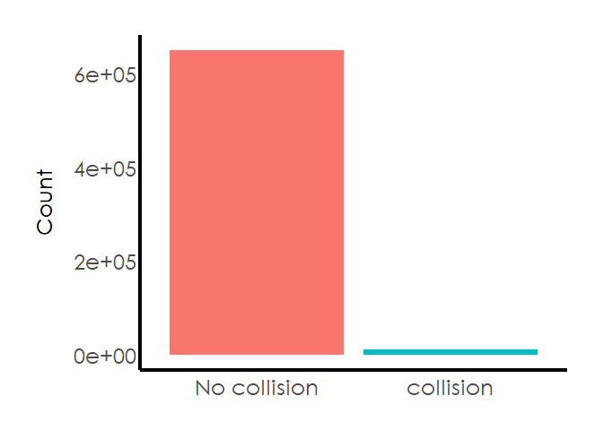
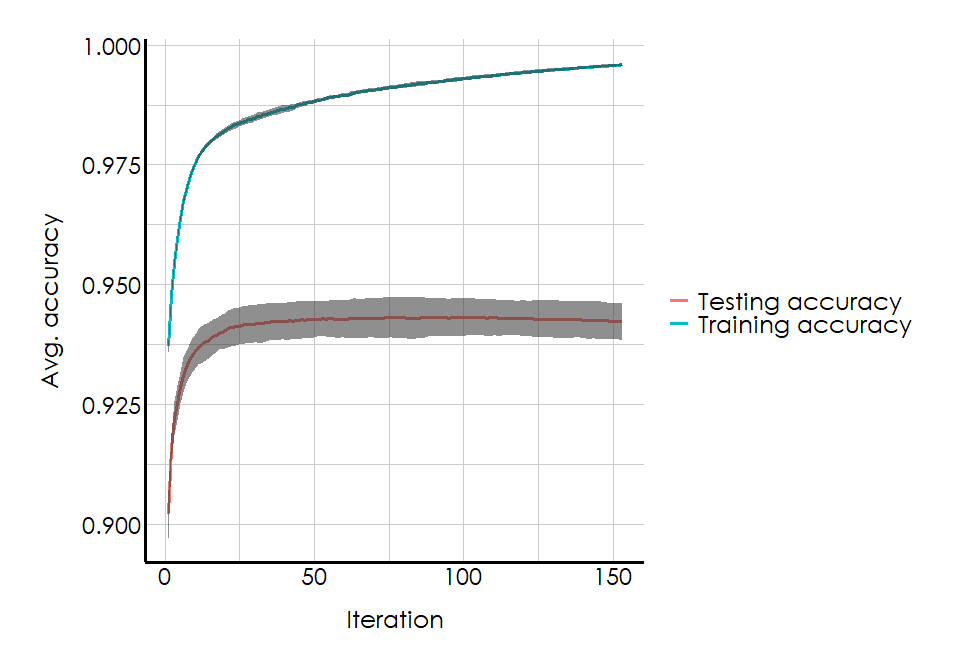
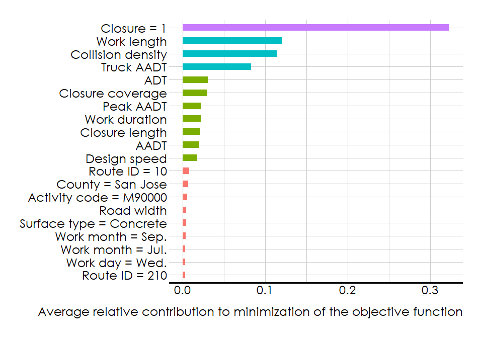

###Extreme Gradient Boosting
================

This is an R Markdown for implementation of an extreme gradient boosting
technique to a big data set for classifying roadside work zones based on
their collision risk. The data set is already prepared and cleaned up.
After partitioning the data into training and testing sets, the class
imbalance is investigated.

``` r
train.ind=createDataPartition(df$collision_id, times = 1, p=0.7, list = FALSE)
training.df=df[train.ind, ]
testing.df=df[-train.ind, ]
```



This figure shows that class distribution is highly imbalanced. However,
the xgBoost algorithm can handle data imbalance with class weights. In
general binary classification, the weight of positive class in xgBoost
parametrization, in this case ‘’Collision’’, is given as the ratio of
number of negative class to the positive class.

``` r
label=as.numeric(as.character(training.df$collision_id))
sumwpos=sum(label==1)
sumwneg=sum(label==0)
print(sumwneg/sumwpos)
```

    ## [1] 61.35867

Since the training set is big enough to cause memory issues. Both
training and testing sets are converted to sparse matrices.

``` r
dtest=sparse.model.matrix(collision_id~.-1, data = data.frame(testing.df))
dtrain=sparse.model.matrix(collision_id~.-1, training.df)
```

For tunning the xgboost hyperparameters, the caret grid search method is
used. Learning rate or <code>eta</code>, maximum depth of trees, and
minimum child weight which measures the number of instances in a node
before the algorithm decides to partition before. <code>gamma</code>
denotes the minimum loss reduction required to make a further partition.
<code>subsample</code> and <code>colsample\_bytree</code> indicate the
proportion of the training data set and features, respectively, used in
training the algorithm. Before training the xgboost model, a parallel
backend must be registered.

``` r
xgb.grid=expand.grid(nrounds=100, 
                     eta=seq(0.1, 1, 0.2),
                     max_depth=c(3, 5, 10),
                     gamma = 0, 
                     subsample = 0.7,
                     min_child_weight = c(1, 3, 5), 
                     colsample_bytree = 1)

myCl=makeCluster(detectCores()-1)
registerDoParallel(myCl)

xgb.control=trainControl(method = "cv",
                         number = 5,
                         verboseIter = TRUE,
                         returnData = FALSE,
                         returnResamp = "none",
                         classProbs = TRUE,
                         allowParallel = TRUE)

xgb.train = train(x = dtrain,
                  y = factor(label, labels = c("No.Collision", "Collision")),
                  trControl = xgb.control,
                  tuneGrid = xgb.grid,
                  method = "xgbTree",
                  scale_pos_weight=sumwneg/sumwpos)
```

The result of the grid search for tunning the xgBoost hyperparamaters
are given below. This is the best configuration of The best
configuration of <code>eta</code>, <code>max\_depth</code>, and
<code>min\_child\_weight</code> is given by:

``` r
xgb.train$bestTune
```

    ##    nrounds max_depth eta gamma colsample_bytree min_child_weight subsample
    ## 16     100        10 0.3     0                1                1       0.1

Using these parameters, a corss-validated training is done with
<code>nrounds=500</code> to identify the best iteration, i.e.,
<code>nrounds</code>. The algorithm can stop early if the test accuracy
is not improved for <code>early\_stopping\_rounds</code> number of
iterations.☻

``` r
params=list("eta"=xgb.train$bestTune$eta,
            "max_depth"=xgb.train$bestTune$max_depth,
            "gamma"=xgb.train$bestTune$gamma,
            "min_child_weight"=xgb.train$bestTune$min_child_weight,
            "nthread"=4,
            "objective"="binary:logistic")

xgb.crv=xgb.cv(params = params,
               data = dtrain,
               nrounds = 500,
               nfold = 10,
               label = label,
               showsd = TRUE,
               metrics = "auc",
               stratified = TRUE,
               verbose = TRUE,
               print_every_n = 1L,
               early_stopping_rounds = 50,
               scale_pos_weight=sumwneg/sumwpos)
```

``` r
xgb.crv$best_iteration
```

    ## [1] 103

The model has the highest accuracy in the 103rd interation. The testing
and training accuracies of the cross-validated xgBoost fitting follow
each other closely, and thus there is no need to consider a <code>gamma
\> 0</code>.



To produce feature importances, an instance of the xgBoost learner is
run with the optimized parameters of the grid search
<code>xgb.train</code> and the cross-validated training
<code>xgb.crv</code>.

``` r
xgb.mod=xgboost(data = dtrain, 
                label = label, 
                max.depth=xgb.train$bestTune$max_depth, 
                eta=xgb.train$bestTune$eta, 
                nthread=4, 
                min_child_weight=xgb.train$bestTune$min_child_weight,
                scale_pos_weight=sumwneg/sumwpos, 
                eval_metric="auc", 
                nrounds=xgb.crv$best_iteration, 
                objective="binary:logistic")
```

The top 20 features with the highest importance are selected here.

``` r
importance=xgb.importance(feature_names = colnames(dtrain), model = xgb.mod)
importance$Feature[1:20]
```

    ##  [1] "closure_id1"            "work_length"            "collision_density11_12"
    ##  [4] "truck_aadt"             "road_adt"               "closure_coverage"      
    ##  [7] "peak_aadt"              "work_duration"          "aadt"                  
    ## [10] "closure_length"         "road_speed"             "route10"               
    ## [13] "countySJ"               "activityM90000"         "road_width"            
    ## [16] "work_monthJul"          "surface_typeC"          "work_dayWed"           
    ## [19] "work_dayThu"            "work_monthSep"

xgBoost internally implements a dummy variable generation to transform
categorical variables with \(k\) levels to \(k-1\) binary variables. The
newly generated dummy variables are names by combining the feature names
and its levles. The below code properly renames the top 20 features with
the highest importance.

``` r
feature.label=importance$Feature[1:20]
feature.label=c("Closure = 1", "Work length", "Collision density", "Truck AADT",
             "ADT", "Closure coverage", "Peak AADT", "Work duration", "Closure length",
             "AADT", "Design speed", "Route ID = 10", "County = San Jose", "Activity code = M90000",
             "Road width", "Surface type = Concrete", "Work month = Sep.", "Work month = Jul.", 
             "Work day = Wed.", "Route ID = 210")
```

The top 20 feautre importances are plotted here. xgBoost records three
measures of importance for trees; <code> Gain </code> which measure the
contribution of each feature to optimization of the objective function,
<code> Cover </code> counts the number of observations assigned to the
feature, and <code> Weight </code> which denotes the number of times the
feature was selected for a tree. The following plot shows the
importances with respect to <code> Gain </code> and has undergon a
little ggplot treatment.

``` r
(gg=xgb.ggplot.importance(importance_matrix = importance[1:20,]))
```


